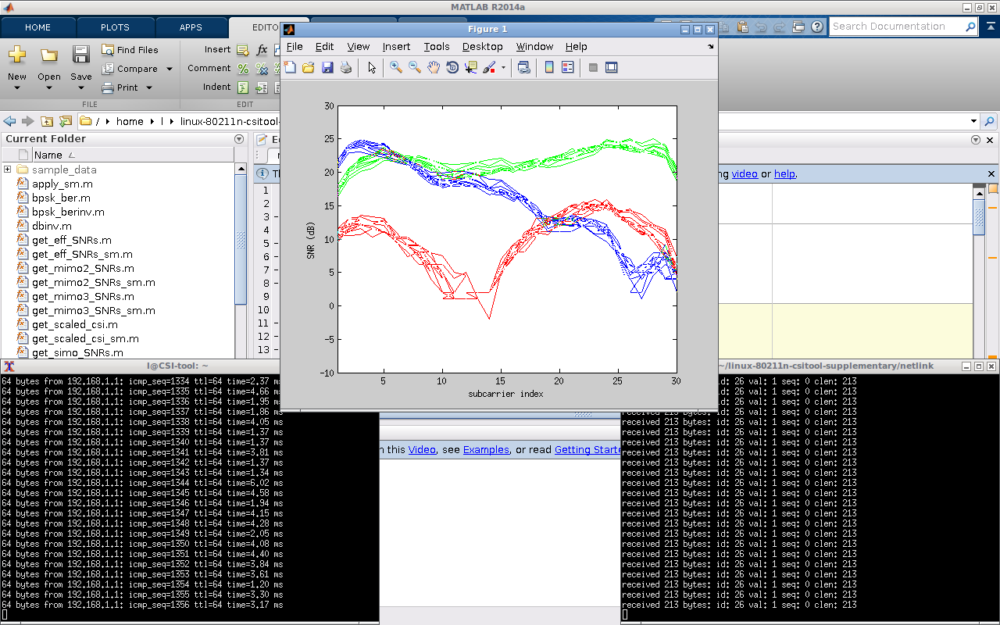

# Realtime-processing-for-csitool
A realtime data processing and visualization plugin for the [Linux 802.11n CSI Tool](https://github.com/dhalperi/linux-80211n-csitool).

# Usage
To use this code, you will need all the files from https://github.com/dhalperi/linux-80211n-csitool-supplementary.

1. In netlink:
~~~
gcc log_to_server.c -o log_to_server
sudo ./log_to_server <ip> <port>
~~~
NOTE: If you don't have the iwl_connector.h file in netlink (which means you are using an early verison of the [Linux 802.11n CSI Tool](https://github.com/dhalperi/linux-80211n-csitool)), please use our [old version](https://github.com/lubingxian/Realtime-processing-for-csitool/tree/master/netlink/old%20version) code.

2. In matlab:
~~~
read_bf_socket
~~~

# Screenshot

# Contact
Email: bingxian.lu@gmail.com

To cite this work, the best reference is our paper published in IEEE SECON 2016:

Bingxian Lu, Zhicheng Zeng, Lei Wang, Brian Peck, Daji Qiao, and Michael Segal. 
Confining Wi-Fi Coverage: A Crowdsourced Method Using Physical Layer Information. 
IEEE SECON, 2016.
